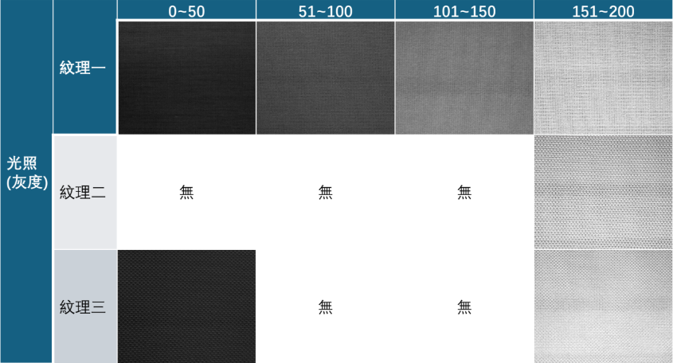
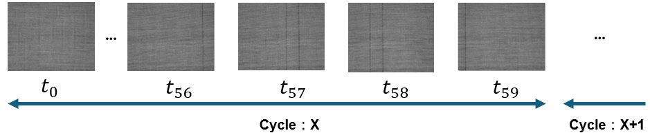
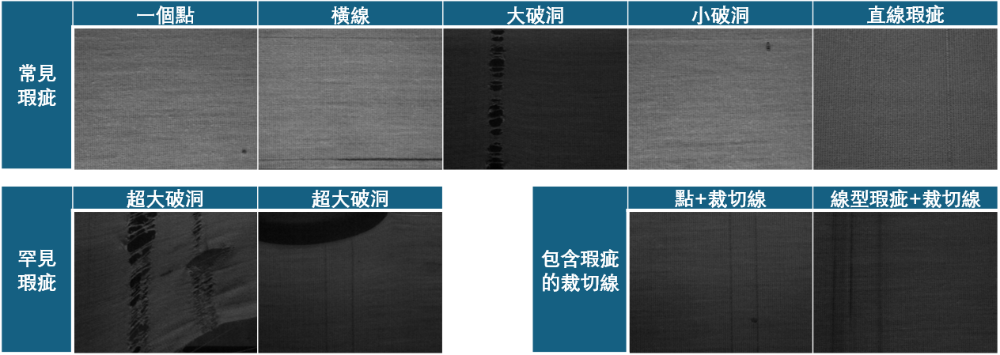
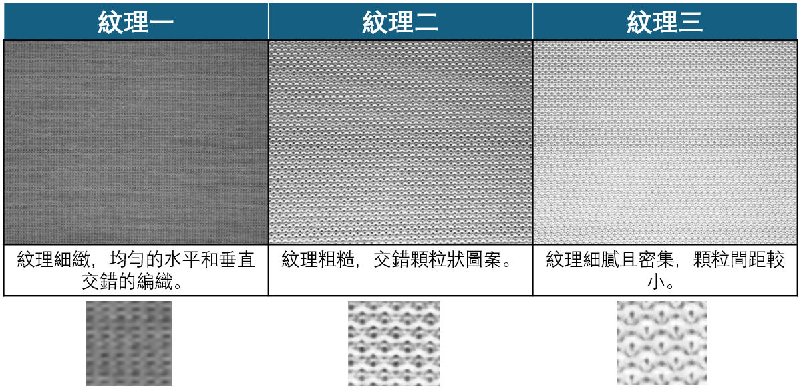
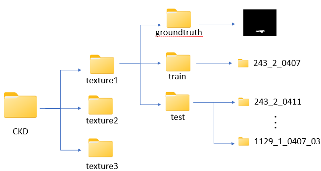

# Time-series circula knitting dataset, 
週期針織布數據集第一版
----台灣中央大學智慧軟體系統實驗室

## 週期針織布數據集第一版介紹
週期針織布數據集第一版由台灣中央大學智慧軟體系統實驗室整理並開源, 共三種針織布類型。該數據集共包含訓練樣本圖像10000張，測試樣本圖像500張，圖像的分辨率分為800x640及400x320兩種。

## 資料集特性
### 裁切線特性
為了幫助在生產後進行精確的裁剪，**圓形針織機** 會在固定的位置設置兩條漏針來形成 **裁切線 (Cutline)**。這些裁切線本身是設計中的一部分，用於引導布匹的裁剪，並非織物缺陷。然而，這些裁切線在外觀上與一些常見的缺陷（如垂直線缺陷 v-line）非常相似，因此在進行實時缺陷檢測時，區分這些裁切線與真正的缺陷是一個關鍵挑戰。

defect-free 樣本圖

### 光照特性
由於相機沒有感光元件, 拍攝的影像容易受到光照條件的影響。由於相機只能捕捉灰度信息而無法分辨顏色, 同一布匹在不同光照下呈現不同的色階，因此在進行實時缺陷檢測時，能正確的在不同色階下區分正常以及瑕疵圖片是第二個挑戰。

### 週期特性
在不同資料集中，圖片的週期可能也不同。所謂週期指的是兩次裁切線出現間隔的圖片個數，在週期針織布數據集
中這個值從60~300都有涵蓋。

以243_1_00為例(週期60)：

### 瑕疵特性
在週期針織布數據集中包含了各式各樣的瑕疵類型，包含一般常見的線型、點型，或是中型破洞瑕疵，另外還有比較罕見的大型瑕疵與和裁切線在同一張圖片的瑕疵。

瑕疵樣本圖

## 資料集結構
資料集中包括三種不同的針織織物紋理，分別標示為 Texture 1，Texture 2 和 Texture 3三類花型，並依據照明條件進行劃分，總共有六個資料集：

## 訓練和測試數據集劃分
每個資料集的訓練集均包含30張隨機選取的影像，其中包括：

+ 15 張正常的織物影像
+ 15 張帶有切線的織物影像

測試集的影像則按照序列進行收集，以反映真實工業流程中的動態特性。下個表格中提供了詳細的訓練和測試數據集劃分：

| Dataset  | 照明條件     | 紋理類型   | 訓練集 (正常/切線) | 測試集 (正常/切線/缺陷) |
|----------|--------------|------------|--------------------|------------------------|
| Dataset1 | 均勻照明     | Texture 1  | 15 / 15             | 5000 / 172 / 49         |
| Dataset2 | 均勻照明     | Texture 2  | 15 / 15             | 1742 / 64 / 21          |
| Dataset3 | 均勻照明     | Texture 3  | 15 / 15             | 4290 / 148 / 42         |
| Dataset4 | 不均勻照明   | Texture 1  | 15 / 15             | 1755 / 67 / 145         |
| Dataset5 | 不均勻照明   | Texture 2  | 15 / 15             | 1580 / 59 / 16          |
| Dataset6 | 不均勻照明   | Texture 3  | 15 / 15             | 1100 / 40 / 34          |

## 文件結構
週期針織布數據集CKD-1文件夾中，包含 Texture 1，Texture 2 和 Texture 3三類布匹型號。
這三類別分别放置於三個文件夾，依次命名為Texture 1，Texture 2，Texture 3，總結構如圖所示。

每種針織布類型的數據集文件包含訓練集train和測試集test兩个子文件夾。其中，訓練集為無缺陷樣本和週期出現cutline樣本,放置於defect-free文件夾, 對應標記缺陷區域放置於groundtruth；
測試集為週期出現樣本circular及標記缺陷區域的groundtruth, 裡面包含defect-free, 週期出現cutline以及有缺陷樣本defect。以Texture 1 為例，它的文件結構圖如下圖所示。

## 下載

稍後公佈
