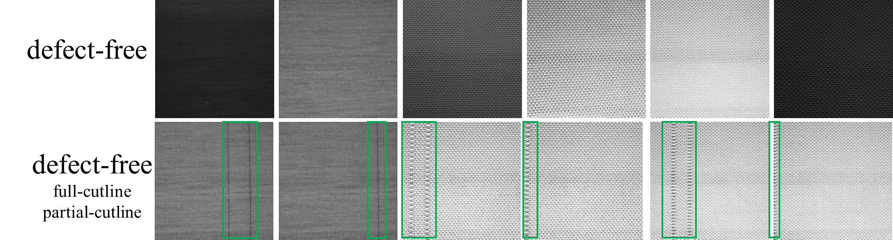

# Time-series circula knitting dataset, 
週期針織布數據集第一版
----台灣中央大學智慧軟體系統實驗室

## 週期針織布數據集第一版介紹
週期針織布數據集第一版由台灣中央大學智慧軟體系統實驗室整理並開源, 共三種針織布類型.该数据集共包含訓練樣本圖像10000张，測試樣本圖像500张，图像的分辨率分为800x640及400x320兩種。

## 資料集特性
### 裁切線特性
為了幫助在生產後進行精確的裁剪，**圓形針織機** 會在固定的位置設置兩條漏針來形成 **裁切線 (Cutline)**。這些裁切線本身是設計中的一部分，用於引導布匹的裁剪，並非織物缺陷。然而，這些裁切線在外觀上與一些常見的缺陷（如垂直線缺陷 v-line）非常相似，因此在進行實時缺陷檢測時，區分這些裁切線與真正的缺陷是一個關鍵挑戰。

defect-free 樣本圖

### 光照特性
由於相機沒有感光元件, 拍攝的影像容易受到光照條件的影響。由於相機只能捕捉灰度信息而無法分辨顏色, 同一布匹在不同光照下呈現不同的色階，因此在進行實時缺陷檢測時，能正確的在不同色階下區分正常以及瑕疵圖片是第二個挑戰。

### 週期特性
在不同資料集中，圖片的週期可能也不同。所謂週期指的是兩次裁切線出現間隔的圖片個數，在週期針織布數據集
中這個值從60~300都有涵蓋，因此要仰賴設定固定的週期數值來做瑕疵檢測是不可行的。

### 瑕疵特性
在週期針織布數據集中包含了各式各樣的瑕疵類型，包含一般常見的線型、點型，或是中型破洞瑕疵，另外還有比較罕見的大型瑕疵與和裁切線在同一張圖片的瑕疵，在進行實時檢測時要特別注意和裁切線在同一張圖片的瑕疵也必須要正確被識別出來。

瑕疵樣本圖

## 資料集結構
資料集中包括三種不同的針織織物紋理，分別標示為 Texture 1（針型ABAB类），Texture 2（針型4角PK类）和 Texture 3（針型4角PK类）三类花型，並依據照明條件進行劃分，總共有六個資料集：

待補上

## 訓練和測試數據集劃分
每個資料集的訓練集均包含30張隨機選取的影像，其中包括：

+ 15 張正常的織物影像
+ 15 張帶有切線的織物影像

測試集的影像則按照序列進行收集，以反映真實工業流程中的動態特性。下個表格中提供了詳細的訓練和測試數據集劃分：

| Dataset  | 照明條件     | 紋理類型   | 訓練集 (正常/切線) | 測試集 (正常/切線/缺陷) |
|----------|--------------|------------|--------------------|------------------------|
| Dataset1 | 均勻照明     | Texture 1  | 15 / 15             | 5000 / 172 / 49         |
| Dataset2 | 均勻照明     | Texture 2  | 15 / 15             | 1742 / 64 / 21          |
| Dataset3 | 均勻照明     | Texture 3  | 15 / 15             | 4290 / 148 / 42         |
| Dataset4 | 不均勻照明   | Texture 1  | 15 / 15             | 1755 / 67 / 145         |
| Dataset5 | 不均勻照明   | Texture 2  | 15 / 15             | 1580 / 59 / 16          |
| Dataset6 | 不均勻照明   | Texture 3  | 15 / 15             | 1100 / 40 / 34          |

## 文件結構
週期針織布數據集CKD-1文件夹中，包含 Texture 1（針型ABAB类），Texture 2（針型4角PK类）和 Texture 3（針型4角PK类）三类布匹型號。
这三類別分别放置于三个文件夹，依次命名为Texture 1，Texture 2，Texture 3，总结构如图所示。

每种針織布類型的数据集文件包含训练集train和测试集test两个子文件夹。其中，训练集为无缺陷样本和週期出現cutline樣本,放置于defect-free文件夹, 對應标记缺陷区域放置于groundtruth；
测试集为週期出現样本circular及标记缺陷区域的groundtruth, 裡面包含defect-free, 週期出現cutline以及有缺陷样本defect。以ABAB花型为例，它的文件结构图如下圖所示。

## 下載

稍後公佈
